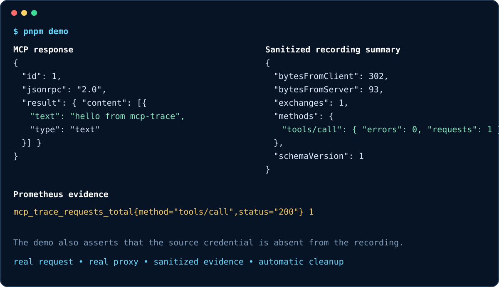

# MCP Trace

[](https://github.com/ryux1/mcp-trace/actions/workflows/ci.yml)
[](https://github.com/ryux1/mcp-trace/actions/workflows/codeql.yml)
[](https://github.com/ryux1/mcp-trace/releases)
[](LICENSE)

**Security-first Model Context Protocol observability for Streamable HTTP.** Put one transparent
gateway between an MCP client and a fixed upstream server to trace, measure, record, inspect, and
safely replay JSON-RPC and SSE traffic.

> **Status:** early preview (`0.x`). The protocol boundary, recording schema, and CLI may evolve
> before `1.0`. Current limits are documented rather than hidden.



## Start in 30 seconds

Requirements: Node.js 20.19 or newer.

```bash
npx -y @ryux1/mcp-trace@latest proxy \
  --upstream http://127.0.0.1:3001/mcp
```

Point the MCP client at `http://127.0.0.1:7331/mcp`. MCP Trace binds only to `127.0.0.1` by default.

To see the complete flow without configuring an MCP client, clone the repository and run:

```bash
corepack enable
pnpm install --frozen-lockfile
pnpm demo
```

The deterministic demo starts a mock MCP server and MCP Trace on ephemeral localhost ports, sends a
real `tools/call`, verifies that the demo credential was redacted, prints a recording summary and a
Prometheus metric, and cleans up every process and temporary file.

## Why MCP Trace?

Generic reverse proxies measure HTTP but do not understand MCP methods, protocol revisions, JSON-RPC
identifiers, or MCP header/body mismatches. Application instrumentation has the opposite problem: it
changes the server and can capture tool arguments or credentials too freely.

MCP Trace keeps the boundary narrow:

- **Transparent:** forwards JSON and streams SSE with backpressure and cancellation propagation.
- **MCP-aware:** identifies methods, protocol revisions, tool/resource names, and mismatches.
- **Safe by default:** records metadata only; body capture requires an explicit second switch.
- **Vendor-neutral:** exports bounded Prometheus metrics and OpenTelemetry spans over OTLP/HTTP.
- **Replay-conscious:** plans a dry run unless `--execute` is supplied and skips unsafe entries.
- **Auditable:** does not implement MCP methods, terminate authorization, or select upstreams.

Use MCP Trace when you operate a fixed Streamable HTTP endpoint and need evidence without modifying
the client or server. Use the official
[MCP Inspector](https://github.com/modelcontextprotocol/inspector) when you need an active testing
client. Use a full MCP gateway when you need server discovery, routing, identity, or policy
enforcement.

```text
MCP client  ──POST / GET / DELETE──▶  MCP Trace  ──transparent HTTP──▶  MCP server
                                            │
                                            ├── Prometheus metrics
                                            ├── OpenTelemetry spans
                                            └── sanitized NDJSON recording
```

## Protocol compatibility

| MCP transport revision            | Status        | Behavior                                                                  |
| --------------------------------- | ------------- | ------------------------------------------------------------------------- |
| `2026-07-28` Streamable HTTP      | Supported     | POST, JSON or request-scoped SSE, `Mcp-Method`, `Mcp-Name`, `Mcp-Param-*` |
| `2025-03-26` through `2025-11-25` | Supported     | POST/GET/DELETE, `Mcp-Session-Id`, `Last-Event-ID`, standalone SSE        |
| `2024-11-05` HTTP+SSE             | Not targeted  | Separate endpoint discovery is outside this fixed-endpoint gateway        |
| stdio                             | Not supported | Requires a separate process and trust-boundary design                     |

The [compatibility matrix](docs/compatibility.md) distinguishes verified behavior from planned work.
An integration test uses the official TypeScript SDK 1.30.0 as both client and server and exercises
initialization, `tools/list`, and `tools/call` through the gateway. See the official
[2026 Streamable HTTP specification](https://modelcontextprotocol.io/specification/2026-07-28/basic/transports/streamable-http)
and
[2025 transport specification](https://modelcontextprotocol.io/specification/2025-11-25/basic/transports).

## Install and run

### npm

Run without a global installation:

```bash
npx -y @ryux1/mcp-trace@latest proxy \
  --upstream http://127.0.0.1:3001/mcp
```

Or install the CLI:

```bash
npm install --global @ryux1/mcp-trace
mcp-trace proxy --upstream http://127.0.0.1:3001/mcp
```

### Container

Versioned releases publish `linux/amd64` and `linux/arm64` images with an SBOM and build provenance:

```bash
docker pull ghcr.io/ryux1/mcp-trace:latest

docker run --rm --network host \
  ghcr.io/ryux1/mcp-trace:latest proxy \
  --host 127.0.0.1 \
  --upstream http://127.0.0.1:3001/mcp
```

For a complete local Jaeger demonstration:

```bash
docker compose -f docker-compose.demo.yml up --build --detach
```

The Compose stack starts Jaeger, a mock MCP server, MCP Trace, and a one-shot client. Select the
`mcp-trace` service at `http://127.0.0.1:16686`. Stop the stack with:

```bash
docker compose -f docker-compose.demo.yml down --volumes
```

## Record and inspect

Metadata-only recording is the default:

```bash
mcp-trace proxy \
  --upstream http://127.0.0.1:3001/mcp \
  --record ./traffic.ndjson
```

Payload capture requires a second, explicit switch:

```bash
mcp-trace proxy \
  --upstream http://127.0.0.1:3001/mcp \
  --record ./traffic.ndjson \
  --record-bodies \
  --redact-key tenant-secret
```

Recording files are forced to owner-only mode (`0600`). Inspect them without starting a server:

```bash
mcp-trace inspect ./traffic.ndjson
```

The output summarizes request counts, failures, bytes, and p50/p95/p99 latency by MCP method. Read
the [recording schema](docs/recording-schema.md) and [security model](docs/security.md) before
capturing production traffic.

## Replay safely

Replay is a dry run by default. It reports how many requests are replayable and skips truncated,
binary, body-less, and redacted entries.

```bash
mcp-trace replay ./traffic.ndjson \
  --upstream http://127.0.0.1:3001/mcp
```

Execute only against a system where repeating tool calls is safe:

```bash
mcp-trace replay ./traffic.ndjson \
  --upstream http://127.0.0.1:3001/mcp \
  --execute \
  --concurrency 4 \
  --rate 20
```

Authorization can be supplied with `--header-env`. Legacy `Mcp-Session-Id` values are never recorded
or replayed, so replay is best suited to stateless 2026 traffic.

## Metrics and tracing

The gateway exposes two local administrative endpoints:

- `GET /__mcp_trace/healthz`
- `GET /__mcp_trace/metrics`

Prometheus metrics include request totals, in-flight requests, recording failures, and latency
histograms. Method-label cardinality is bounded; tool/resource names are not used as metric labels.

Export spans to any OTLP/HTTP collector:

```bash
export OTEL_AUTHORIZATION='Bearer collector-token'

mcp-trace proxy \
  --upstream http://127.0.0.1:3001/mcp \
  --otlp-endpoint http://127.0.0.1:4318 \
  --otlp-header-env Authorization=OTEL_AUTHORIZATION
```

Each span includes HTTP method/status, MCP method, protocol revision, upstream address, and detected
header/body mismatch fields. Tool/resource names appear only on individual spans. MCP Trace
preserves JSON `_meta.traceparent`, `_meta.tracestate`, and `_meta.baggage` fields without rewriting
them, and separately propagates standard HTTP trace headers.

## Security boundary

MCP Trace is not a data-loss-prevention system, authorization server, protocol validator, or dynamic
forward proxy. The upstream is fixed at startup. Redaction is defense in depth, not proof that a
recording contains no sensitive data.

Authenticated upstream headers are loaded from environment variables instead of command arguments:

```bash
export MCP_UPSTREAM_AUTHORIZATION='Bearer replace-me'

mcp-trace proxy \
  --upstream https://mcp.example.com/mcp \
  --upstream-header-env Authorization=MCP_UPSTREAM_AUTHORIZATION
```

When binding to `0.0.0.0` or `::`, at least one `--allow-host` value is required. Browser origins
are rejected unless explicitly allowed. Review recordings before sharing them.

## Verification and evidence

```bash
pnpm verify
pnpm smoke:package
pnpm demo
pnpm benchmark
```

The verification gate runs formatting, ESLint, strict TypeScript checks, unit and integration tests
with coverage thresholds, and a clean build. Package smoke testing installs the generated tarball in
a temporary consumer project and proxies a real request through the installed executable. Hosted CI
runs that consumer and demo path on Linux, macOS, and Windows.

Benchmark methodology and versioned raw results are documented in
[docs/benchmarks.md](docs/benchmarks.md). Results are treated as regression evidence, not production
capacity claims.

## Documentation

- [Documentation site](https://ryux1.github.io/mcp-trace/)
- [Architecture](docs/architecture.md)
- [Security and threat model](docs/security.md)
- [Recording schema](docs/recording-schema.md)
- [Compatibility matrix](docs/compatibility.md)
- [Observability integrations](docs/integrations.md)
- [Troubleshooting](docs/troubleshooting.md)
- [Benchmarks](docs/benchmarks.md)
- [Roadmap](docs/roadmap.md)
- [Contributing](CONTRIBUTING.md)
- [Security policy](SECURITY.md)

## License

[MIT](LICENSE)
