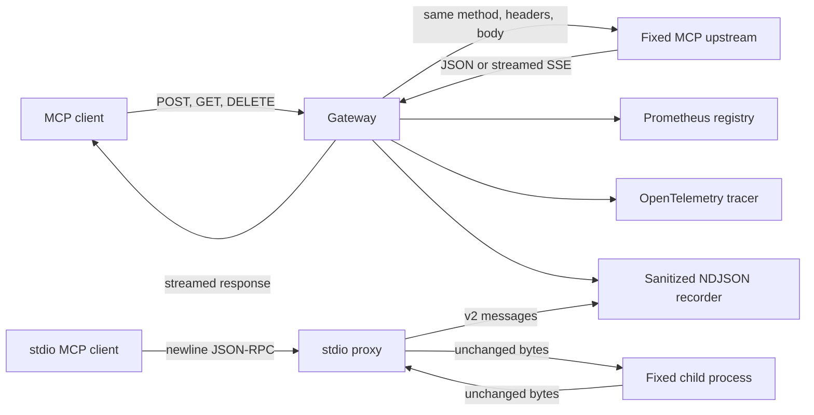

# Architecture

## Boundary

MCP Trace is a fixed-upstream transport proxy with MCP-aware observation. It does not instantiate an
MCP client or server and does not interpret tool results as application state.

For HTTP, the fixed upstream URL is supplied at startup. Incoming paths cannot select a different
origin, which keeps the gateway from becoming an open forward proxy or general SSRF primitive. For
stdio, the executable and argument vector are fixed at process launch and never selected by MCP
traffic.

## HTTP request lifecycle

1. Match the configured MCP endpoint or a reserved local administration endpoint.
2. Validate the Host header and, when present, the Origin header.
3. Accept POST plus the GET/DELETE methods used by 2025 Streamable HTTP.
4. Bound and read POST bodies. GET and DELETE remain body-less.
5. Extract MCP metadata for observation. Header/body mismatches are recorded but not blocked.
6. Remove hop-by-hop and spoofable forwarding headers, inject configured upstream headers, and
   propagate W3C Trace Context.
7. Send the request to the fixed upstream without following redirects.
8. Forward response status and end-to-end headers. Stream response chunks with Node backpressure.
9. On client disconnect, abort the upstream request. Record final status, byte count, and latency.
10. Drain pending record writes before shutting down the recorder and trace provider.

The gateway sends `Accept-Encoding: identity` upstream. This avoids a class of reverse-proxy bugs
where Fetch decompresses a response while the original `Content-Encoding` or `Content-Length`
metadata is forwarded.

## stdio message lifecycle

1. Spawn one fixed executable and argument vector with shell execution disabled.
2. Forward each original stdin chunk to the child and each child-stdout chunk to the client through
   bounded newline observers; bytes and line endings are unchanged.
3. Parse a copy of each complete line for JSON-RPC kind, identifier, method, and request/response
   correlation. Parsing never rewrites the forwarded message.
4. Keep child stderr on the proxy's stderr stream and outside recording/protocol stdout.
5. On stdin EOF, close child stdin. On SIGINT or SIGTERM, request child termination and force it
   after the configured grace interval if needed.
6. Return the child's abnormal exit code to the caller and close the recorder after both output
   streams drain.

## Transport revisions

The 2026 transport is stateless at the protocol layer. Each request is a POST, and routing metadata
is mirrored through `MCP-Protocol-Version`, `Mcp-Method`, `Mcp-Name`, and optional `Mcp-Param-*`
headers. A response can be one JSON object or an SSE stream scoped to the request.

The 2025 transport can assign `Mcp-Session-Id`, open standalone SSE with GET, resume with
`Last-Event-ID`, and terminate sessions with DELETE. MCP Trace preserves those headers and methods,
but stores only a one-way 16-hex-character session correlation hash.

The gateway intentionally does not rewrite JSON bodies. In particular, it preserves the 2026
OpenTelemetry keys in `_meta` exactly as the client sent them. HTTP W3C Trace Context is extracted,
a gateway span is created, and the resulting HTTP context is injected upstream as a separate
transport-level concern.

## Modules

| Module                 | Responsibility                                                    |
| ---------------------- | ----------------------------------------------------------------- |
| `proxy/gateway.ts`     | HTTP lifecycle, backpressure, cancellation, forwarding, shutdown  |
| `proxy/protocol.ts`    | JSON-RPC/MCP metadata extraction and mismatch detection           |
| `proxy/security.ts`    | Host and Origin validation                                        |
| `stdio/framing.ts`     | Exact-byte newline observation and per-message bounds             |
| `stdio/protocol.ts`    | Bidirectional JSON-RPC classification and request correlation     |
| `stdio/proxy.ts`       | Child execution, stream forwarding, environment, and lifecycle    |
| `recording/*`          | capture, redaction, NDJSON I/O, strict inspection, offline report |
| `telemetry/metrics.ts` | low-cardinality Prometheus counters and histograms                |
| `telemetry/tracing.ts` | Node OpenTelemetry provider and OTLP/HTTP export                  |
| `replay/replay.ts`     | dry-run planning, rate limiting, bounded concurrency, execution   |

## Failure semantics

- A request larger than the configured limit returns HTTP 413.
- A rejected Host or Origin returns HTTP 403 before contacting the upstream.
- Unsupported methods return HTTP 405 with `Allow: POST, GET, DELETE`.
- Connection/setup failures before upstream headers return a JSON-RPC-shaped HTTP 502.
- Failures after response streaming begins destroy the downstream response; changing the already
  emitted status would be incorrect.
- Recording failures increment a metric and are logged, but do not rewrite a completed upstream
  response.
- Reaching a configured recording ceiling stops later recording writes, emits one warning, and does
  not change HTTP responses or stdio forwarding.
- Oversized or unterminated stdio messages fail the proxy without rewriting the observed bytes.
- A stdio child exit is propagated as an exit code or signal result; stderr text is not interpreted
  as failure because MCP permits informational logging there.

## Recording consistency

An HTTP exchange is written only after the proxied response completes or fails. A stdio message is
written after its complete newline-delimited frame is observed; correlated responses include the
request method and duration. Concurrent writes use a serialized admission queue and a single append
stream, producing one JSON object per line. With `--max-recording-size`, the recorder counts the
file size at append-open time and admits a full UTF-8 line only when it fits; an exact fit is
allowed. The first non-fitting entry atomically moves the recorder to a stopped state, so no
application-level line prefix is written. Graceful shutdown rejects new writes, drains already
admitted transport work, and then closes the recording stream.

On restart, append recovery uses the current on-disk byte count. A process or operating-system crash
during an already admitted stream write can still leave a torn final line, as with ordinary append
I/O; the reader reports such malformed input rather than silently accepting it. A recording path is
owned by one MCP Trace process at a time—concurrent external writers are outside this consistency
model.

Recordings are designed for diagnostics, not as a durable event store. For high-volume or
multi-process deployments, consume OpenTelemetry and Prometheus signals and treat NDJSON capture as
a bounded incident-analysis tool.
